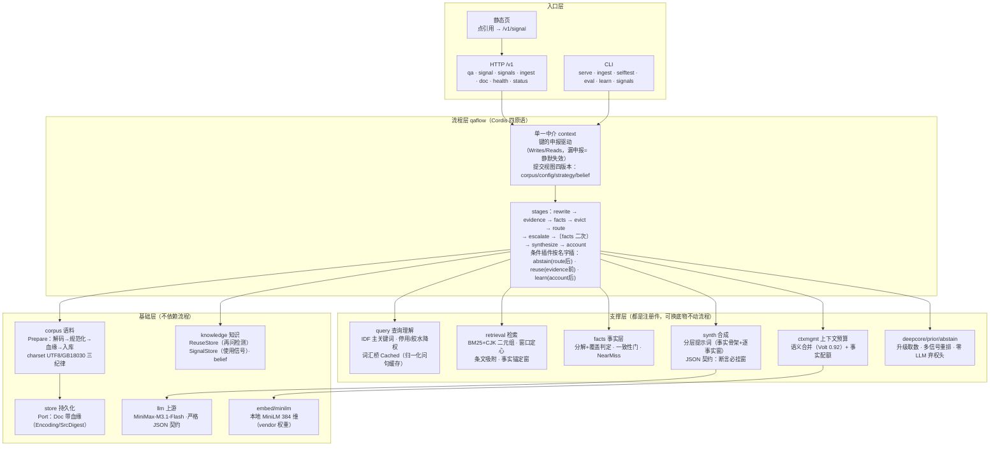
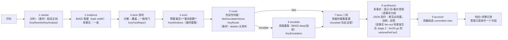

# cumulus-next 架构图（评审版）

两图一分层静态结构、二一次问答的数据流；之后是诚实边界。文字描述以
docs/flow-grammar.md（流程）与 docs/architecture.md（分层）为 SSOT，本
文件只画图。

## 对外输出面：internal/harness（事件流）

harness 的职责是"让人看见系统在干什么"。旧 cumulus 有过一套输出流（OpenAI chat 帧 +
`cumulus` 扩展帧），能力搬到了新骨架，**这个面没搬过来**——现在只有一次性 JSON
响应，思考、引用、进度全压在跑完之后。`internal/harness` 把它补回来并按新纪律重做。

**事件词表**（继承旧 cumulus 的形状，老前端可直接吃；新增 `related`）：

| 事件 | 载荷 | 对应你的需求 |
|---|---|---|
| `started` | 问题、run id | — |
| `stage` | 阶段名 + 相位 + 耗时 | **输出进度**（阶段时间线） |
| `file` | rank / docid / 标题 / 分数 / 坐标 / 预览 / 是否被引用 | **引用的文章**（检索到一个就发一个）+ 检索日志 |
| `reasoning` | 思考片段 | **全部思考过程** |
| `content` | 答案片段（可 `replace` 整段覆盖） | 答案流 |
| `citations` | docid + 坐标 + 原文 + 可回溯标记 | **引用的文章**（终态、可核） |
| `related` | 取回未引用 / 同文档其他片段（why 字段说明理由） | **关联文档** |
| `done` | 答案 + 路由 + 校准 + 计量 + **提交视图** + 决策留痕 | 收尾对账 |
| `error` | 错误文本 | 失败也是事件（然后礼貌收尾） |

**四条契约**（各有测试钉死，不靠人记）：

1. **缺席不改行为**：没挂 sink 时 Emit 是空操作（连 Emitter 都没有也不炸）。
   可选增强不许变成依赖——外部服务缺席不许改变问答结果。
2. **顺序即真相**：`seq` 从 1 单调、`at_ms` 相对起点；事件顺序 = 流程顺序，
   回放能重建时间线（stage 在窗口之前、引用在答案之后）。
3. **降级必须可见**：sink 写失败**不阻断**问答，但计数并可查（`Health.Dropped` +
   原因）；"没接上"与"接上了但丢了事件"分得开。
4. **事件即数据**：每个事件 JSON 往返不变，可单独落库重放（离线回放/评测复用
   同一份）。

**出口**：`SSEStream`（`event: <kind>` + `data: <json>`，带心跳，不依赖 net/http
→ 任何宿主可用）、`Recorder`（内存回放/测试）、`SinkFunc`（普通函数即出口）。
构造器拒绝半截事件——**事件流里出现半截事件比不出事件更坏**。

**分层**：`harness` 归 capabilities，**只依赖 kernel**。它**不许依赖 qaflow / api**
（boundary 门禁会拦），代价是载荷用朴素结构体而不复用 qaflow 类型——这是有意的
解耦成本：harness 必须是"出口"，不能是又一个内部耦合点。

## 分层与依赖方向（internal/arch 门禁，第九道）

`internal/` 下二十几个包此前**没有任何地方声明过"哪个包属于哪层、谁可以依赖谁"**——依赖方向靠人记着，而人记不住（已发生过的漂移：evalfcore 反向依赖 context、synth 依赖 qaflow、judge 依赖 evalfcore）。现在分层写成数据、方向写成规则，由 `internal/arch` 对着**真实导入图**跑一遍（`go list`），违反即红——与 grammar-conformance 同一套路：**不靠评审靠门禁**。

| 层 | 包 | 只能依赖 |
|---|---|---|
| **kernel** | `context` `flow` `marks` `arch` | kernel（自己） |
| **ports** | `store` `decide` | kernel |
| **capabilities** | `abstain` `calib` `corpus` `ctxmgmt` `deepcore` `embed` `evaldata` `evalfcore` `facts` `failure` `ingest` `knowledge`(+`/belief`) `learncore` `llm` `minilm` `prior` `query` `rerank` `retrieval` | kernel / ports / capabilities |
| **pipeline** | `qaflow` `synth` `judge` | 下面三层 |
| **apps** | `api` `cmd/**` | 任何层（但不被任何层依赖） |

**规则**：同层允许（cmd→api、能力件互依）；下层被上层依赖是正常的；**反向禁止**。被这套规则防住的正是三件坏事：底座被业务流程反向依赖、能力件长出对流程的依赖（那样它就不能单独复用）、流程去依赖应用面。

**新增包必须登记归属**（不登记 = 没有约束 = 门禁形同虚设 → `TestEveryInternalPackageIsRegistered` 会红）；表里也不能留幽灵包（`TestNoGhostPackagesInTable`）。`cmd/**` 按前缀归层，新增 cmd 包不必改表。

**为什么不做 Turborepo 之类的编排器**：本项目是**纯 Go 单 module**（无 go.work、无 package.json），Go 自带的构建缓存已经按包/编译单元做得更细；Turborepo 的价值在 JS workspace 的多包任务图，这里**没有多语言边界可编排**，接入只会给 Go 仓库加一条 Node 工具链。要做的是**边界**（本节）和**出口**（`internal/harness` 事件流），不是构建编排。

**分层的直接回报**：`internal/harness`（事件词表 + 问答入口）会成为唯一对外出口，后续项目（UI/别的 agent/CLI）只依赖它，不直接碰 `qaflow`/`context`——整合是"加一个 adapter"，而不是"接进二十几个包"。

## 一、分层结构（静态）

## 二、一次问答的数据流（动态）

## 三、诚实边界（评审时请盯这些）

1. **合成面是 LLM 的**：流水线保证"证据取对、取全、摆对结构"，最终措辞
   与数值提取的稳定性由 MiniMax 决定（Noesis 判定：7B 以下瓶颈在上下
   文利用）。破局链已把可控部分做到头，残余方差是模型固有。
2. **再问即加深（唯一由使用直接驱动的行为）**：同一会话原样再问 =
   用户说"上次不够"——本轮 topk×2、窗宽×1.5、强制升级（词汇桥+贵路
   重取）。复用库从"重放器"退成"再问检测器"：个人工具重放同一个不够
   好的答案是伪需求（一次检索毫秒级，省机器时间赔用户答案）。
3. **停车三件**（小时级、有界收益，未做）：冲突门子情形分流（醉酒
   "五年vs十年"是不同子情形非真冲突）、fact 视图进前端、GBK 语料
   清洗。
4. **无 session 不问复用**：一次性问答（不带 session）不记信号、不进再问
   ——这是选择不是遗漏：没有"再问"的上下文就没有那一族信号。
5. **词面判据的边界已由判官兜底**：覆盖判据（内容词占比+3 字核心）认
   不出改写，未盖事实问一次模型（只升级不降级、失败不阻塞、裁决可
   见——judge 字段）。 Patent 两连问全链因此通了：锚点落第四十二条 →
   判官救回 f1 → 分组带判官裁决 → 模型给出"二十年/十年/十五年"。

## 四、数字（2026-10-08）

25 个包（23 个有测试；无测试的两个是 minilm 的 vendored forward 与 flow 的 runner）·
**八门禁全绿**（gofmt/vet/test/grammar-conformance/dumb-arm-invariant/contract-gen/
doc-fresh/file-size）· 唯一外部依赖：MiniMax API（合成/桥）与 ~/.cumulus/models
的 MiniLM 权重。

提交视图（v0.2 §五.4）已上服务面：`/v1/qa` 的 `committed` 字段带四版本 +
路由校准档位（语料版本 = 内容摘要，改一个字就变）；路由信号档位记
`retrieval`（provider 不返回 logprobs，优先档未接）；评测的对照运行强制
含哑臂 `bm25-bare`（零改写零管理）。
