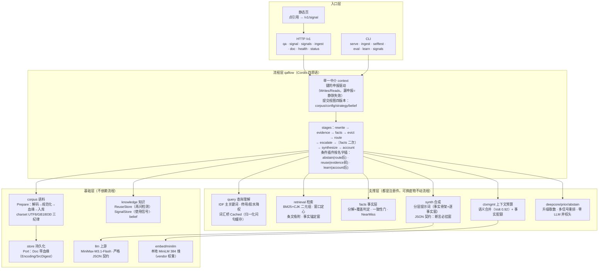
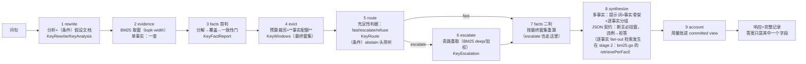

# cumulus-next 架构图（评审版）

两图一分层静态结构、二一次问答的数据流；之后是诚实边界。文字描述以
docs/flow-grammar.md（流程）与 docs/architecture.md（分层）为 SSOT，本
文件只画图。

## 一、分层结构（静态）

## 二、一次问答的数据流（动态）

## 三、诚实边界（评审时请盯这些）

1. **合成面是 LLM 的**：流水线保证"证据取对、取全、摆对结构"，最终措辞
   与数值提取的稳定性由 MiniMax 决定（Noesis 判定：7B 以下瓶颈在上下
   文利用）。破局链已把可控部分做到头，残余方差是模型固有。
2. **再问即加深（唯一由使用直接驱动的行为）**：同一会话原样再问 =
   用户说"上次不够"——本轮 topk×2、窗宽×1.5、强制升级（词汇桥+贵路
   重取）。复用库从"重放器"退成"再问检测器"：个人工具重放同一个不够
   好的答案是伪需求（一次检索毫秒级，省机器时间赔用户答案）。
3. **停车三件**（小时级、有界收益，未做）：冲突门子情形分流（醉酒
   "五年vs十年"是不同子情形非真冲突）、fact 视图进前端、GBK 语料
   清洗。
4. **无 session 不问复用**：一次性问答（不带 session）不记信号、不进再问
   ——这是选择不是遗漏：没有"再问"的上下文就没有那一族信号。
5. **词面判据的边界已由判官兜底**：覆盖判据（内容词占比+3 字核心）认
   不出改写，未盖事实问一次模型（只升级不降级、失败不阻塞、裁决可
   见——judge 字段）。 Patent 两连问全链因此通了：锚点落第四十二条 →
   判官救回 f1 → 分组带判官裁决 → 模型给出"二十年/十年/十五年"。

## 四、数字（2026-10-08）

25 个包（23 个有测试；无测试的两个是 minilm 的 vendored forward 与 flow 的 runner）·
**八门禁全绿**（gofmt/vet/test/grammar-conformance/dumb-arm-invariant/contract-gen/
doc-fresh/file-size）· 唯一外部依赖：MiniMax API（合成/桥）与 ~/.cumulus/models
的 MiniLM 权重。

提交视图（v0.2 §五.4）已上服务面：`/v1/qa` 的 `committed` 字段带四版本 +
路由校准档位（语料版本 = 内容摘要，改一个字就变）；路由信号档位记
`retrieval`（provider 不返回 logprobs，优先档未接）；评测的对照运行强制
含哑臂 `bm25-bare`（零改写零管理）。
