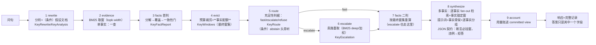

# cumulus-next 架构图（评审版）

两图一分层静态结构、二一次问答的数据流；之后是诚实边界。文字描述以
docs/flow-grammar.md（流程）与 docs/architecture.md（分层）为 SSOT，本
文件只画图。

## 一、分层结构（静态）

## 二、一次问答的数据流（动态）

## 三、诚实边界（评审时请盯这些）

1. **合成面是 LLM 的**：流水线保证"证据取对、取全、摆对结构"，最终措辞
   与数值提取的稳定性由 MiniMax 决定（Noesis 判定：7B 以下瓶颈在上下
   文利用）。破局链已把可控部分做到头，残余方差是模型固有。
2. **信号面只观测不改行为**：reask 族/cite 族落盘可聚合，但"用信号做
   重排"必须是 learncore 的受管变更（白名单旋钮+冻结评测对照），不在
   这里自动接。
3. **停车三件**（小时级、有界收益，未做）：冲突门子情形分流（醉酒
   "五年vs十年"是不同子情形非真冲突）、fact 视图进前端、GBK 语料
   清洗。
4. **无 session 不问复用**：一次性问答（不带 session）不记信号不复用
   ——这是选择不是遗漏：没有"再问"的上下文就没有那一族信号。
5. **词面判据的边界**：覆盖判据是内容词占比+3 字核心，认不出深度改写
   （"期限是多少年"vs"期限为二十年"已用内容词齐聚锚绕过）；彻底解法
   是 LLM 事实感知评分（cumulus 之路），未搬。

## 四、数字（2026-10-08）

25 个包（22 个有测试）· 七门禁全绿 · 37 提交 · 唯一外部依赖：
MiniMax API（合成/桥）与 ~/.cumulus/models 的 MiniLM 权重。
