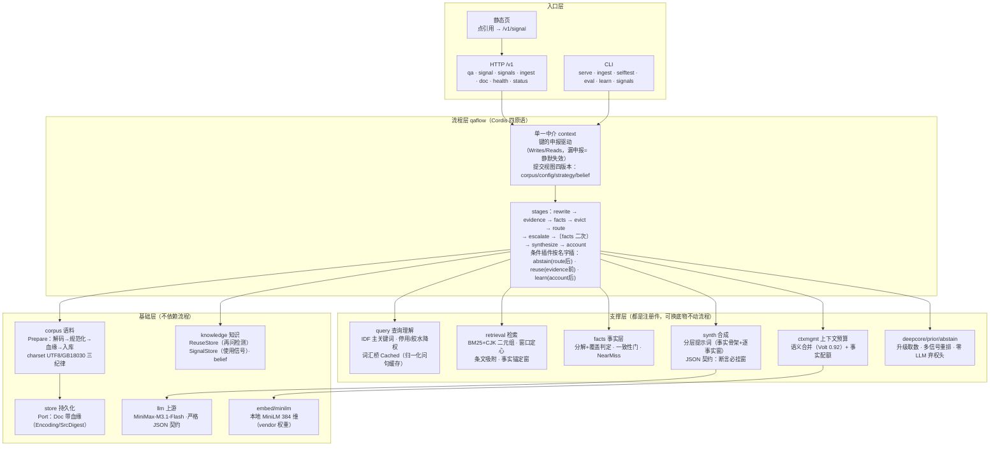
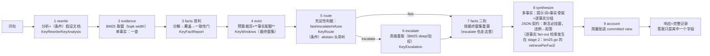

# cumulus-next 架构图（评审版）

两图一分层静态结构、二一次问答的数据流；之后是诚实边界。文字描述以
docs/flow-grammar.md（流程）与 docs/architecture.md（分层）为 SSOT，本
文件只画图。

## 端到端验收脚本（scripts/acceptance.sh）

链路上每一条承诺写成断言，**任何人任何时候都能复跑**：改了哪一环坏了哪一环，当场红。

```bash
DASHSCOPE_API_KEY=… bash scripts/acceptance.sh      # 真模型
bash scripts/acceptance.sh --offline                # 离线（不花 LLM 钱）
```

覆盖九组：能力可见面 / 问答（有据 + 拒答）/ 词汇桥与升级 / 事件流 / 会话回放 /
知识文档（生成 + 同主题增量）/ 选题建议 / 多租户隔离 / **失败路径**（空主题、坏 JSON、
无证据——都必须给出可读原因）。

**它第一次跑就抓出五个真 bug**（health 说谎、Rebuild 集合口径错、watch 按错索引、
开关在 serve 没接线、桥钉死了启动索引）。详见
[status-report.md](status-report.md) 第二节。

## 选题建议：从"不满意"的信号里挑主题

知识文档的质量取决于**选题**，而选题的最好来源不是拍脑袋，是"**哪些问题我们答不上来
/ 答了还要再问**"——这些正是知识库的空缺处（信号库一直在记）。

```
GET /v1/docs/topics     cumulus topics
```

### 四条纪律

1. **只建议，不自动生成**——自动往语料里灌文档等于用没验证的规则污染知识库。
   人工挑一个，走 `POST /v1/docs`；这条人工闸门是刻意的。
2. **只用"不满意"信号，不用"满意"信号**——引用被点开（cite）说明那段知识**已经够用**，
   把它当选题会让人去重写正在起作用的内容。
3. **已覆盖的主题要标出来（不是过滤掉）**——知道"这块已经有文档了"与不知道它存在同样
   重要：前者提示"**该更新而不是新建**"（`covered=true` + `doc_id`）。
4. **排序可解释**：分数 = Σ(权重×次数)，权重写死并随响应返回
   （`refusal_unsatisfied=2.0` > `answer_incomplete=1.0`）。

### 真跑读数

```
[拒答后追问 ×2 · 分数 4.0] 太湖蓝藻怎么治理
[答后追问 ×1 · 分数 1.0] 专利年费标准是多少
→ 生成过文档后：专利年费怎么交 covered=True doc=gen-3f2178534df0
```

**途中修掉一个 CLI 静默失效**：`case "doc"` / `case "topics"` 传的是**完整 args**
（含子命令名），而其他分支传 `args[1:]` → `-data` 被当成子命令名丢弃 →
`cumulus topics` 永远读不到信号（服务端的 `GET /v1/docs/topics` 却正常）。
**症状是"HTTP 面能用、CLI 静默返回空"**——这类不一致只有真跑两个入口都试才会暴露。

### 设计边界（写清楚以免误读）

主题键只归一化**空白与全/半角标点**，不做语义归并："怎么治理"与"怎么治理？"是**两个
候选**（它们是真的不同问句），但全角/半角问号等价 → 生成时落到**同一篇文档**。

## 同主题文档的增量更新：覆盖写 + 版本 + 差异

**为什么必须有**：生成文档是**可重复生成**的产物。用户补资料、改源文档、换问法都会
再生成一次。若每次写新文档，语料里会有三五篇内容高度重叠的同主题文档——**检索互相
竞争、读者分不清哪篇最新**，"整理一次、问答受益"变成"整理越多越难查"。

- **同主题 → 同一篇**：文档 id = `gen-<主题键>`（归一化主题的哈希），再生成是**覆盖**；
- **版本与差异摆出来**：`v2 · 新增 1 条 · **移除 3 条**` 写在正文标记里；
- **信息损失要说**：新一版少了内容（源被删/检索退化）是**移除**，必须显式报出；
- **首次生成不报差异**：没有上一版可比，说"与上一版一致"是撒谎（真跑踩到）。

元数据存在 `corpus.Doc`（`kind/topic_key/version/sources/generated_at`）而**不是正文**：
正文要原样可读，而版本与来源清单是机器账——塞进正文会被索引进倒排。

### 真跑踩了三个坑，全部是"读数在撒谎"

1. **首次生成报"内容与上一版一致"**——`Revise(nil, …)` 走了"无差异"分支。
   修法：`Revision.First` 显式区分"没有上一版"与"内容没变"。
2. **同主题两次生成报"新增 4 条、移除 5 条"**——模型两次措辞不同
   （"为每**一百九十元**" vs "为每**一**百九十元"、"**请求减缓**" vs "**申请缓缴**"）。
   修法按真跑数据逐级换口径：字面 → 字符集合相似(0.9) → **二元组覆盖(0.75)**，
   并**剥掉 `[1][2]` 引用标记**（模型有时把引用写进 claim 文本）。
3. **判据也解决不了**——最后加了 `EquivalentJudge`（LLM 判同一件事，
   失败/缺席一律算不同，方向保守）。**实测仍判不同**：`请求减缓年费…` 与
   `申请缓缴年费…` 在真实模型眼里确实可以不是同一件事。

**如实说清当前状态**：同主题覆盖、版本递增、不堆重复——这三条**结构上可靠**；
差异说明**仍偏多报**（宁可多报差异，不可谎报合并）。真要更准，就得给论断一个
稳定的**语义 id**（而不是靠文本比对），那是更大的设计。

## 知识文档生成：把散落的证据整理成一篇可核对的文档

**为什么它是主要产物**：问答只回答"这一次问的"，**文档沉淀"这一整块知识"**。
用户真正想要的是"关于这个主题我该知道什么"，而不是"这一问的答案"——所以生成物是
**文档**，且**写回语料**（整理一次、问答受益）。

三个入口同一口径：`POST /v1/docs`、`cumulus doc "主题"`、内部包 `internal/docgen`。

### 一、结构化条目 + 综述头（为什么不是一篇散文）

每条论断挂引用（`source_id` + `span`），所以它是**可核对的**；缺口显式列出，
读者一眼知道边界在哪：

```
标题: 专利年费怎么交，逾期会怎样   覆盖: 2/3 条证据 · 3 节 · 3 处缺口
## 年费标准与缴纳期限
   - 专利权人应当自专利权授予之日起每年缴纳年费。 [0762591b5cb]
## 逾期缴纳的处理
   - 未在规定期限内缴纳的…滞纳金。逾期未补缴的，终止专利权。 [0762591b5cb]
缺口: 具体缴费方式查不到 — 证据未说明可以通过哪些渠道缴纳
缺口: 规定期限的具体计算方式查不到
```

### 二、四条纪律

1. **挂不上引用的不许写进文档**：越界/幻觉引用 → 该条**丢弃**；一条都挂不上 →
   **整体报错、不产出半截文档**（半截文档会被当成可信资料存进语料，比没有更坏）。
2. **文档进语料**（`gen-` 前缀 id，与手抄文档同集合、同索引口径）。
3. **诚实的覆盖度**：`windows_used/total`、`sections`、`gaps`、`facts_covered/total`
   都摆在正文前面——不假装完整。
4. **半截信息比没信息更难解释**：JSON 埋在解释文字里能救（推理模型常见形状）；
   真的不合约定就失败，不"尽力而为"。

### 三、真跑发现的问题：**整理了但没被引用**

第一次真跑：文档生成成功、也写进库了，但问答**一直引用源文档**。原因是结构性的：
生成文档是**源的转述**——词面高度重叠、篇幅更长，BM25 天然比不过更短更密的源。

解法（两处口径，必须一致）：正文加 `<!-- cumulus:generated -->` marker（人读不可见）
+ id 用 `gen-` 前缀，检索期 `SearchWith` 的 boost 把生成文档压到 **0.85**。

**压权重不等于压掉**：先答不上来的问题，转述文档恰恰是更好的答案（它已把多篇源拼在一起
并标出缺口）。真跑验证：

```
「专利年费的缴纳期限与滞纳金」 → 引用源文档   0762591b5cb#rune[0:158]
「年费标准是多少」            → 命中生成文档 gen-f65454ec4a22#rune[0:400]
```

### 四、顺带修掉一个**多租户越界**（与 docgen 无关，但被它撞出来）

`-watch` 摄入用 `-realm`（空），而带凭证的请求落在**凭证推出的 realm**：
文档写进 `documents/`，查询读 `documents/<realm>` → **"watch 说导入了 3 篇，问答却 0 窗口"**。
现在 watch 用**凭证的 realm**（多 realm 时打印警告并只写第一个——多 realm 不该用 watch 摄入）。

## 架构调整（2026-10）：小而美——拆文件 + 划出 tooling 层

### 为什么要做这件事

用**工具接入面**（chat/completions、MCP、DSH 插件）之前先量了一遍"独立 RAG 引擎"的
实际形状，发现两处与"小而美"不符：

1. **单文件塞多件事**：`internal/qaflow/qa.go` 475 行里装着**六个 stage**；
   `cmd/cumulus/eval.go` 589 行同时装"执行器装配"与"实验编排"；`api.go` 588 行同时装
   "服务是什么/怎么路由/怎么采样响应"。改一处会与另一处撞在一起。
2. **开发工具与引擎混在一层**：评测、校准、学习闭环、人工批注（**tools**）与检索、合成
   （**引擎**）住在同一层，任何方向错误都不会被门禁发现。

### 一、拆文件（按职责，不按行数）

| 原文件 | 拆成 | 依据 |
|---|---|---|
| `qaflow/qa.go` 475 | `qa.go` 107（只剩共享词汇）+ `stage_rewrite/evidence/route/synthesize/account.go` | **一个 stage 一个文件 → 与文法（flow-grammar §三）一一对应** |
| `api/api.go` 588 | `api.go` 320 + `versions.go` 289（四版本/按 realm 索引/响应采样） | "服务是什么" vs "响应怎么采" |
| `cmd/cumulus/eval.go` 589 | `eval.go` 255（执行面）+ `eval_run.go` 333（跑与读数） | 接线 vs 编排 |
| `cmd/cumulus/main.go` 467 | `main.go` 275 + `serve.go` 192 | 分发 vs **装配**（装配最容易静默失手） |
| `retrieval/bm25.go` 408 | `bm25.go` 83（建索引）+ `search.go` 325（打分） | 数据结构 vs 排序策略（后者可实验） |
| `retrieval/window.go` 462 | `window.go` 186（切窗口）+ `anchor.go` 276（挑窗口） | 纯坐标算法 vs 启发式 |
| `facts/facts.go` 453 | `facts.go` 153（分词/分解）+ `eval.go` 299（覆盖评估/冲突） | 语言学近似 vs 流程契约 |

现在**最大的文件是 423 行**（`calib`，属于暂停的 tooling），引擎侧最大 382 行。

### 二、划出 tooling 层（**评测与学习暂停投入**）

新增 `LayerTooling`——与 capabilities 的区别不是"重要性"，而是**谁需要它**：
capabilities 是**引擎运行**要的能力，tooling 只在**我们开发/测量这个引擎**时才需要。

分层的意义是一条**可执行的边界**：`kernel / ports / capabilities / pipeline / apps`
**不得依赖 tooling**。没有这条线，"为了加个读数就 import 评测包"会在几个月里把引擎
拖成它自己的工具。

例外**显式且有界**（`allowedToolingUse`，加一条要写理由）：
- `cmd/cumulus`、`cmd/humanbatch`：工具的宿主（eval/calib/learn/verify 子命令住这儿）；
- `api → knowledge/learncore`：`/v1/signals` 露的是**线上使用信号读数**（服务能力），
  不是评测功能。

**这条规则当场抓出四个真实越界**，改掉两个错判：
- `qaflow → abstain`（弃答权重门）、`qaflow → knowledge`（复用命中）**是运行时能力**，
  我原先误放进 tooling → 改回 capabilities（层判错的证据）；
- `cmd/humanbatch → evalfcore/evaldata` 是合法的工具宿主 → 进白名单。

门禁还钉住"暂停"这个决定：`evalfcore / calib / evaldata / learncore / judge` 必须在
tooling 层——谁想给评测加新能力，会先撞到这条门禁看到"暂停投入"的说明。

### 三、"知识文档生成"是下一个主攻方向

摄入、检索、合成都有，**但"把知识整理成文档"这件事没有**——而它才是个人知识库的
主要产物（答案是副产品）。这是当前最大的功能缺口。

## 失效模式规约（新增能力前必读）

四类"接线错"在几轮里连续发生：可选面互相挡掉、往还没写的记录里写读数、方法值把能力
丢掉、装配状态只在出错时可见。它们**都不是逻辑错**——编译过、测试绿、读数看着正常，
只有真跑才显形。每类现在都有机械门禁（`internal/qaflow/wiring_test.go`、
`internal/arch`）或结构约束。

规约正文见 [failure-modes.md](failure-modes.md)，含"新增能力时的六问自查"。

## 窗口分级（GaRAGe 四类）：让检索日志可解释

`file` 事件原本只带 rank/分数/预览：用户看到"检索到了这篇"，但**说不出为什么是它**。
分级把"检索日志"变成**可解释的**检索日志——分数说"排第几"，类别说"有没有用"：

```
ANSWER   直接给出了问题的答案
RELATED  只谈相关话题，没有答案
OUTDATED 给的是过时的答案
UNKNOWN  无法判断（"判了但判不了"）
```

**这是可解释性诉求，不是准确率诉求**：分级**不参与**检索排序，也不进路由判据；
它只让证据带上一句"这条是答案 / 只相关 / 过时 / 判不了"，让用户自己判断。

### 五条设计取舍

1. **用 chat LLM，不用决策模型**：分类是**结构化抽取**（要 JSON），决策模型的
   choice/noul/score 装不下"逐条分类"。第一版我按决策模型写，结果写了一堆不存在的
   方法——**选错工具比写错代码更贵**。
2. **一次调用逐条判**：逐条问要 N 次调用，且模型看不到邻居（分级本来就是对同一批证据
   的整体判断）。
3. **半截结果整体失败**：漏标/越界/重复/非法类别名 → 报错并返回空。理由与其他构造器
   一致：**半截信息比没信息更难解释**。真跑里这确实拦下了一次（模型只标了部分窗口）。
4. **空 ≠ UNKNOWN**：没开分类器是**空**（未分级），UNKNOWN 是"判了但判不了"。
   消费方必须能分开，所以响应里有 `classification.{enabled,applied,outcome,counts}`
   四段。
5. **非法类别名不进事件流**：宁可构造失败，也不要下游收到"也许吧"。

### 又一次"往还没写的记录里写读数"

第一版把分级结局记在 `EscalationRecord.Classification` 上，而分级发生在升级**之前**——
那条记录当时还不存在，于是结局恒空。**与桥那次完全同一个坑**，我改挂点时又踩了一次。
现在分级有**自己的挂点**（`KeyWindowClass`），没有时序依赖。

### 还有一个更隐蔽的：`emitter == nil` 顺手当掉了分级器

`/v1/qa`（一次性 JSON）**不装 emitter**（只有 `/v1/qa/stream` 装），而 `traceFunc`
早退条件是 `if em == nil { return nil }` —— **把分类器一起挡掉了**。读数表现是
`enabled=true, applied=false`，极具欺骗性（"装了却不工作"）。现在早退条件是
`em == nil && opts.WindowClassifier == nil`：**别把一个可选面顺手当掉另一个**。

**真跑读数**（CUMULUS_CLASSIFY=1，gap 语料）：
```
「养狗扰民谁管」   applied=true counts={"ANSWER":1}
「专利每年要交多少钱」 applied=true counts=null ← 分级跑了但回包没过校验 → 被"半截即失败"挡掉（可见，不静默）
```

第二题那个"空"是**模型的回包问题**，不是接线问题——严格性在正常工作。

## 使用信号进学习层：库在写，一直没人读

**缺口**：`SignalStore` 每天在记三类信号（拒答后追问 / 答后追问 / 引用点击），
`/v1/signals` 也能看计数——但**没有任何东西消费它们**。学习层那条入口
（`learncore.Observation`）只吃**离线评测的失败分类**：要一套题、一个判官、一次跑。
于是"越用越准"这件事，线上那一半的数据**从来没进过学习层**。

`internal/learncore/usage.go` 补上第二条入口（`ObserveUsage`）：

```
SignalStore ──▶ UsageObservation ──▶ /v1/signals.usage
   （三类信号）      （只观察不推断）      （可执行读数）
```

### 三条纪律

1. **只观察不推断**：这里**不做因果归因**，只把信号数成读数。谁把它变成旋钮提议，
   仍要走 Hypothesizer 的白名单（模型也越界不了）。
2. **计数不是分数**：`Reasked=3` 说的是"发生过 3 次"，不是"有多错"。混成分数就会
   开始编故事。
3. **nil 信号库要报错**：**"没接入"与"没有信号"是两件事**，前者返回零读数会让运维以为
   系统很健康。

### 不满粗界（不是满意度）

`UnsatisfactionRate = (拒答后追问 + 答后追问) / 全部信号`。它**不是满意度**：
cite（正反馈）与追问（负反馈）混在一个分母里，只能当粗读的"多少次交互以不满收场"。
真满意度要把两类分开数——而那要求知道"没被点开的引用数"，现在**没有意义**（无穷大）。

### 途中抓到一个"读数自己骗自己"的 bug

第一版把 `SignalStore.TopQuestions` 的返回**再聚合一次**——但它**已经把同问句聚合并把
次数写进 Note**（返回的是一行一"问句"，不是一行一信号）。于是"被拒后又追问 2 次"被
按行数重数成 1 次。**不报错、看起来合理、直接把读数做错**——测试抓到后改成读 Note。

**真跑读数**（真模型）：
```
summary: 拒答后追问 1 · 答后追问 1 · 引用点击 0 · 不满粗界 100%
Top 被拒问句: [{"question":"太湖蓝藻怎么治理？","count":1}]
```

**还没做的（说清楚）**：这些读数目前只是**可见**——**没有**任何旋钮会因它们自动调整
（提议仍要人工/LLM 走 Hypothesizer 白名单）。这是刻意的分两步：先让数据可见、
可信，再谈自动调参；反着做就是"用没验证的读数自动改行为"。

## 护栏的拦截分支：数据上触发不了，如实记下来

`rejected-score` 是护栏唯一的**拦截**动作。上一轮在 gap 探针上它没被触发（桥扩得准，
护栏不该拦——这是对的）。于是造第二个探针专门试它：`scripts/prep_gap.py --family drift`。

**构造刻意机械**（防"为护栏造胜证"的偏置）：同一个词尾「年费」套在 6 个领域上
（专利年费 / 房租年缴 / 保险年费 / 会员年费 / 培训年费 / 车险年费），问句一律用同一批
口语模板，**不手工挑哪题会扩偏**。21 篇语料（6 金标 + 15 同领域干扰）。

**读数（真模型 + 真桥，12 题）**：
```
带护栏  evidence=100.0%  桥 采纳 11
无护栏  evidence=100.0%  桥 采纳 11
```

**结论是反的、也是诚实的**：这批歧义题上桥**一次都没扩偏**——`rejected-score` 没被触发
不是因为护栏失灵，而是**桥真的没歪**。

所以关于这条分支现在的状态，说清楚：
- **行为层**：有测试钉死（桥分更低 → 弃用并保留朴素好窗口；桥更好 → 采纳）。
  护栏开关也可消融（`CUMULUS_BRIDGE_GUARD=0` 确认它真能关掉）。
- **数据层**：**触发不了**。我没有为了"量到它"去人为制造更歪的桥——那叫自证。

要让它在数据上被触发，需要一批**真会扩偏**的语料：那种问句的合理解读**不在语料里**，
而桥会自信地扩到一个**存在但错误**的主题上（例如问"孩子入学要交多少"，语料里全是
**成人**培训与保险的"年费"，桥扩出"学费/年费"把窗口拉到成人培训费）。这类样本在真实
个人库里并不罕见（口语 + 家庭/医疗/教育混合主题），但要造得**自然**而不是**定向**，
我没有把握——与其造一个可疑的，不如留着这条"数据未覆盖"的注记。

## 桥终于能上场了：三处接线缺陷（连错四次才找到）

上一条记录说"护栏的收益未测"。这一节是把它测出来的过程——**四次尝试都读"桥一次没走"，
每次的猜测都错**。逐条列出来，因为这类"某能力永远不上场"的 bug 极难靠读代码发现。

### 三个真正的缺陷（按发现顺序）

1. **零窗口直接拒答**（`route.go`）：`!grounded → refuse` 在**路由阶段**就结束，
   而桥住在**升级阶段**里。词面全落空（最需要桥的那种情况）**永远走不到桥**。
   修法做成开关 `CUMULUS_ZERO_WINDOW_ESCALATE=1`（默认关）：先升级再判不知道；
   **没有升级执行处时仍然直接拒答**（先升级是空转）。

2. **单臂没装升级执行处**（`cmd/cumulus/eval.go`）：`escalateFn` 原来只在**级联臂**装配，
   于是单臂"升级触发了 10 次、桥一次没走"（`no escalation backend wired`）。
   桥的接线与"要不要测级联"被混成一件事，**后者悄悄关掉了前者**。现在所有臂都装贵路。

3. **提示只在出错时打**：`bridge: 无 LLM` 只在 `err != nil` 时打印，于是"桥压根没装"
   这件事**没有任何输出**。现在装配状态无条件打印（已装配 / 已关 / 缺席）。

顺带加了可观测（都是这次被逼出来的）：`escalation.bridge` 记 `skipped:no-expander` /
`skipped:not-thin` / `used` / `rejected-score` / `rejected-empty` / `weighted-error`；
评测摘要 `bridge(采纳 N x% · 弃用 M {...})`；`CUMULUS_BRIDGE_DEBUG=1` 打印触发判定
（analysis / primary / oov / thin / expander / weighted）。

### 探针语料（scripts/prep_gap.py）：**第一版也失败过**

要让桥被需要，得同时满足三件事：语料**远大于 topk**（否则召回平凡）、干扰文档用**问句的
表面词**却不含答案（首程够不着金标）、问句用口语而文档用书面。第一版只有 5 篇 / topk=9
→ evidence 恒 90%（平凡）、桥零次触发；第二版加到 42 篇（5 金标 + 37 干扰）才成功。

**它是合成的探针，不是基准**：读数只在这份语料上有意义。

### 三臂读数（真模型 + 真桥，10 题）

| 臂 | evidence | 桥结局 |
|---|---|---|
| 关桥（`CUMULUS_BRIDGE=0`） | 90.0% | 10 × skipped:no-expander |
| **开桥无护栏**（`CUMULUS_BRIDGE_GUARD=0`） | **100.0%** | 采纳 10 |
| **开桥带护栏**（默认） | **100.0%** | 采纳 10 |

**护栏在这批上没花钱也没坏事**——桥本来就扩得准，护栏不该拦它，这正是它该有的表现。
反过来说：**这批题上没有"桥扩偏"的样本，所以护栏的拦截收益仍未被量到**
（`rejected-score` 分支只有行为测试兜着）。要量它需要一批**桥会扩偏**的语料——
那是下一个探针要造的。

## 词汇桥的质量护栏：桥必须**证明自己有用**

上一轮只给"桥扩偏"做了兜底（加权 0 命中 → 退回朴素检索）。但那抓不住真正会伤人的
情况：**桥扩偏时不会返回 0 命中，它会返回"很自信的噪声窗口"**（真跑教训："养狗叫得太吵"
扩出噪声，窗口被拉去太湖流域管理条例）。

### 护栏：拿朴素路做对照，分低就弃用

```
plain  ← 朴素贵路（一直都会跑的那条）
weighted ← 桥 + 加权重取
采纳 weighted，当且仅当 weighted[0].Score ≥ plain[0].Score × 0.75
```

- **只看首窗分，不看窗数**：桥的价值是召回更宽，用窗数判会把"召回更好"误判成"更差"；
- **0.75 不是真理，是假设**：桥召回面更大、同批文档最高分理应不低于朴素路，留 25%
  容忍是为了不因"桥召回更好但最高分略低"把好桥毙掉。语料/桥表现变了要按数据调；
- **多跑一次朴素路几乎不要钱**（BM25 是微秒级），比"整轮被带歪"的代价便宜几个数量级。

### 桥的结局必须留痕

`EscalationRecord.Bridge` ∈ `used` / `rejected-score` / `rejected-empty` / `weighted-error`，
进每题结果与评测摘要（`bridge(采纳 N x% · 弃用 M {...})`）。**桥失手是质量问题不是事故**：
日志会被刷掉，只有读数能进回归对比。

途中踩了两个坑（都是"行为对、记录空"这一类）：

1. `Run` 末尾用**调用前的局部快照**收尾，把 `noteBridge` 写进 context 的值覆盖了；
2. `escalateRetrieve` 跑在 `context.Set(KeyEscalation, …)` **之前**——记录当时还不存在，
   `noteBridge` 无处可写，结局恒空。修法是取数前先把初始记录种进 context。

**真跑读数**（真模型，鸿沟问句）：
```
「专利的年费怎么交」升级=是 桥=rejected-empty 拒答=否 引用=1
「专利费一年多少钱」升级=是 桥=rejected-empty 拒答=否 引用=1
「第一条规定了什么」升级=是 桥=rejected-empty 拒答=否 引用=1
```
三题都走完"桥失手 → 退回朴素路 → 答对且有引用"。**没量到效果的地方也说清楚**：
DuReader hard 40 题上桥**一次没走**（40/40 未走桥），所以这条护栏的**收益在该语料上
未测**（evidence 57.5% 与基线一致，无回归），目前只有行为测试兜着。

## 输出面的三条护栏（加固：慢消费者 / schema 版本 / 保留期）

上一轮把 harness 的规则逐条核实了一遍：**8 条已由测试钉死**，另有 3 条**只是约定**。
这三条是当时发现真缺口，现在补上（都有测试）。

### 1. 慢消费者不拖住流程（`AsyncSink`）

`Emit` 里 `sink.Write(ev)` 是同步内联的，而 **io.Writer 的写不可取消**——对端卡住时
既不能"超时返回"，也不能"放弃"（放弃会让下一次写与它交错，把流写坏）。所以正解不是给
写加超时，而是**把写移出流程协程**：

- 单写者协程 + 有界队列 → **顺序仍是 Emit 顺序**（契约 2 不破）；
- **遥测帧**（stage/file/started/related）队列满即丢并计数——丢一帧进度好过卡住整个
  问答；**交付帧**（reasoning/content/citations/done/error）等到超时才丢：答案可以等，
  不可以丢；
- `Close()` **排空队列**再收尾（否则 done 帧会丢）。

真跑：24 帧全部送达；测试里 200 帧 + 30ms 慢写者，Emit 全程 <400ms（不按帧数线性增长）。

### 2. 事件 schema 版本位

`Event.V`（当前 1）+ `DecodeFrame()`：消费方遇**不认识的主版本显式失败**。
直接 `json.Unmarshal` 会把不认识的结构悄悄解成零值（内容帧丢失、引用为空），而调用方
以为"帧到了"——这类静默兼容失败最难查。约定：字段改名/删除/语义变化 = 升主版本；
加可选字段 = 不升。

### 3. 会话事件保留期

落库的是**用户提问原文 + 引用原文 + 思考过程**，多租户共用 store 时"只增不减"既是
成本问题也是数据问题。

- 清单带 `expires_at`（默认 7 天，`CUMULUS_SESSION_TTL` 可配，**配错不静默放宽**）；
- `DELETE /v1/sessions/{id}` = 用户显式删除；
- `PruneExpired` + 后台清扫（`CUMULUS_PRUNE_EVERY`，默认 1h）= 到期就删；
- **续写不重置到期时刻**（否则"一直问同一 session"会让事件永不过期）；
- 时间戳解析失败按**未过期**处理：宁可多留，也不因为一个坏时间戳删掉整场会话
  （删除不可逆）。

**周期与 TTL 故意分开**：TTL 决定"多久算过期"，周期决定"多久才真的删"。真跑
（TTL=3s、周期=4s）：`清理过期会话 1 场（24 帧）` → 查询 404。

## 多租户：realm 物理隔离 + 凭证鉴权（"后续整合项目"的底线）

**动因**：多个项目/租户共用一个实例时，此前**没有任何隔离**——realm 只是 context
上的一个标签，语料是全局单一集合（`documents`），且**完全没有鉴权**。谁都能读全部
语料、谁都能摄入。

### 三层都分开，缺一层就是门锁上了窗户

| 层 | 做法 | 为什么 |
|---|---|---|
| **身份** | `internal/auth`：`CUMULUS_KEYS=realm=key,...`，realm 由**凭证推导** | 客户端声明自己是谁毫无意义——任何人都能声明别人的 realm |
| **存储** | `corpus.CollectionFor(realm)` = `documents/<realm>` | 查错集合得到"没有"，不是"别人的数据" |
| **检索** | `Server.IndexFor(ctx, realm)`：按 realm 分索引（按需重建） | 只分集合、索引共用 = 检索面仍会串 |

**realm 是显式参数**（`ingest.Text(ctx, port, realm, …)`）而不是从 context 取：
漏传的后果是**写进别人的集合**（静默跨租户污染），编译器能抓的错误不留给人记。

### 三条纪律

1. **默认宽容**：没配 `CUMULUS_KEYS` 一切放行（本地/单机老路径一字不变），但启动
   打印醒目提示——多租户部署忘了配 key 是危险状态，不该静默。
2. **401 ≠ 403**：缺凭证 401、凭证错 403（前端要能区分"登录"与"没权限"）；错误体
   **不泄露 realm 列表**（那是给攻击者的地图）；key 用常数时间比较。
3. **写后作废**：摄入后 `InvalidateRealm(realm)`——否则多租户模式下"刚摄入的文档在
   问答里查不到"（索引是缓存，缓存该写后作废，而不是指望谁记得重建）。

### 顺带修掉两个真 bug（都是真跑才暴露的）

- **启动时钉死索引指针**：`srv.Escalate = BM25DeepEvidence(srv.Index(), …)` 把索引
  指针在启动时固定，摄入进来的新文档永远不在里面 → 升级检索恒 0 窗 → "刚摄入的文档
  一问答就拒答"。改成每次调用现取。
- **桥失手被当成"没证据"**：LLM 词汇桥扩偏时，加权重取可能 0 命中，而升级重判据此
  拒答——可 facts 明明有支撑（得分 12.8）。**0 命中不等于语料里没有证据**：加权路
  0 命中/出错时退回朴素贵路（桥是增强，它失手不该等于系统失忆）。

  顺带说明：曾试过改"升级后按合并窗重判"，被既有测试 `TestEscalateWithNoEvidenceRefuses`
  拦下——那个契约（贵路确实取不到就拒答）是**有意的诚实的不知道**，不该被我推翻。
  撤回，改成上面那个更准确的修法。

**真跑读数**（`CUMULUS_KEYS='alpha=…,beta=…'`，两个 key 共用一个实例）：
```
无凭证 → 401    错凭证 → 403    /v1/health → 200（探活不鉴权，否则负载均衡判死）
alpha 摄入自己的文档 → 问「报销」→ 答「公司的报销上限是每月5000元。」
                            citations=['5083c4011b30b63f#rune[0:29]']
beta  问同一句        → refused=True, windows=0   ← beta 的索引里没有 alpha 的文档
```

**隔离断言的正确写法**：断言**命中的文档身份**，不是命中数——BM25 的 top-k 截断会把
零分文档也返回（真跑踩过：用"命中数=0"证明隔离，结果单篇索引照样返回那篇零分文档
——数字对、结论错）。

## 会话层：事件流可回放、可断线恢复

一次流式问答常在十几秒到几十秒；用户在移动网络上会断线、切后台被挂起、刷新页面。
只发一次 live 流的端点在这个现实里**丢东西**——丢的不是答案（能重问），是**过程**
（已流出的进度/思考/正文），而那恰恰是用户唯一无法重建的部分。

`internal/harness/session.go` + 三个端点：

```
POST /v1/qa/stream（带 session）      → 边发边录（同一批事件两处消费）
GET  /v1/sessions/{id}                → 清单：count / last_seq / complete
GET  /v1/sessions/{id}/events?cursor=N → 补页（SSE，**帧形状与实时完全一致**）
```

四条纪律：

1. **回放形状 = 实时形状**（同一批构造器、同一个 SSE 编码器）——客户端**一套解析器**
   通吃实时与回放。曾见过两套格式的分歧：回放少了 thinking 通道，重连后思考区整个
   不出现。
2. **清单增量提交**（每 8 帧）+ 终态帧提交：真跑踩出来的——一次问答几十秒，用户
   在**跑到一半**时掉线是常态；清单只在终态写的话"进行中的会话"根本查不到（客户端
   读 4 帧就断 → 问清单得到 404 → 补页无从下手）。代价是清单会写多次、读到的
   `count` 可能略微落后——它本来就是**进度读数不是账本**，补页按 seq 直接读事件，
   不依赖 count。
   "没清单 = 没提交"仍然成立：半程被 kill 的会话不冒充完整。
3. **Record 幂等**：同 seq 覆盖，清单数按**最大序号**走（不按调用次数）——否则
   重复写会把数虚增，回放多出空位，客户端误判为缺口。
4. **nil store 是合法状态**：没挂持久化就照常发流（缺席不改行为），查询回 404
   而不是空列表（空 200 会让客户端以为"没事件"而不是"没会话"）。

`RecordingSink` 是"边发边录"的机械保证：回放的不是另一条链路，就是这条流记下来的
同一批事件，所以两处**不可能不一致**。

**真跑读数**（真模型，客户端只收 7 帧就断开）：
```
清单: {"count":47,"last_seq":47,"complete":true}
补页: started stage×… file×2 content×18 … citations related done
      + 头帧 "replay: 47/47（最后序号 47，已收尾）"
```

## 宿主侧胶水的两份副本（保持字节一致）

| 副本 | 位置 | 用途 |
|---|---|---|
| 上游示例 | `evoke-ui-project/examples/ebui-example-ai/src/cumulus-transport.js` | 给别人看"自研后端怎么接"的活例子（已随 PR 提交） |
| 本仓 | `examples/evokechat/cumulus-transport.js` | 服务端侧留一份，便于对照 Go adapter 与前端映射 |

**两份必须字节一致**（真跑接出来的一处坑：console 的
`transport(content, attachments, context)` 是三个参数，第二个是**附件数组不是
AbortSignal**——按位置假设会把它当 signal 用。现在按**形状**判断（`typeof
arg2.aborted === "boolean"`），并自带 `cancel()` 供 `@stop` 调，因为 console
根本不传 signal，中止只能靠宿主自己的句柄）。

---

## 宿主侧胶水：examples/evokechat/cumulus-transport.js

Go 里的 `internal/harness/evokechat` 是同一套映射的 **Go 版**（服务端与测试用）；
前端跑不了 Go，所以 `examples/evokechat/cumulus-transport.js` 是它的 **JS 镜像**。
两侧必须同步改——事件词表变了两边都要动。

**引擎 API 逐个核过存在性**（v0.4.1 `useChatEngine` 的返回值，共 49 个方法）：
transport 用到的 11 个**全部真实存在**，其中三个是核对后才敢用的：

| 想做的事 | 真实 API | 注意 |
|---|---|---|
| 阶段进度 | `setProgress(msg.id, {label, detail, elapsedMs})` | 组件直接渲染这三项（`message.progress.*`），**收尾引擎会清掉**；percent 组件不画，要进度条就自己用 `onStage` 画 |
| 整段替换正文 | `updateMessage(msg.id, {content})` | **没有** `setContent` |
| 引用面板 | 只能靠 `onCitations` 宿主回调 | **没有** `setSources`；面板用 `EbChatSources` 插槽或 `addArtifact` |

**接入三行**：
```js
import { createCumulusTransport } from './cumulus-transport'
const engine = useChatEngine({ onSend: createCumulusTransport({ engine }) })
```
`onSend` **必须返回 Promise 直到流结束**——引擎的 loading 挂在这一刻，生成中发送钮
才会变停止钮（stoppable）；提前 resolve 会让 loading 立刻回落、停止钮不出现。

**已升级到 evoke-chat 0.5.0**（`ce832c8`）并真跑验证：

```
引擎 0.5.0：appendProgress 22 · appendToolCallArgs 2 · startToolCall 1 ·
            appendToolCallResult 1 · appendContent 13 · updateMessage 1 ·
            completeMessage 1 · clearProgress 1 · setUsage 1 · completeToolCall 1
            parts 顺序 = tool → text · 行内锚点 ✓
引擎 0.4.1：setProgress 23（自动退回单行）· 其余一致 ← **缺席是合法状态**
```
交错验收（P0-1 的验收项）用合成帧跑通：`text → tool → text` **按到达顺序**渲染，
锚点脚注 `

根据 [1](source:d1) 篇文档。` 正确追加。

**新发现的问题（对方需处理）**：`clearProgress(msgId)` 把 `progressLog` **一起清空**
（`useChatEngine.js:350`），于是"系统轨迹"在答案出来后**不可回看**——它只是个
存活期面板。而"这次查了什么、为什么这么答"恰恰是用户事后最想看的（我们的 viewer
就是靠逐帧记录留存下来的）。建议：`clearProgress` 只清 `progress`（当前行），
`progressLog` 作为**可折叠的历史**留存，或加 `keepLog` 选项。

## 事件浏览器（viewer）：自证事件词表够用

`internal/api/web/index.html`（embed 在 `/`，**零构建**：改它不需要 npm，一个二进制全带走）。

它的职责不是"做个好看的界面"，而是**自证 harness 交出的信息是完整的**：
一个只消费 SSE 的最简 UI 能显示进度、思考、引用、关联文档与收尾，说明事件词表够用；
显示不出来的地方就是 **harness 的缺口**，而不是界面的锅。

**显示的东西**：进度条（percent 是事件给的，UI 不自己编）+ 阶段时间线（中文标签 /
这一步干了什么 / 耗时）+ 思考区（流式期间自动展开，收尾收成一行可再展开）+ 答案
（增量 + 光标，`replace` 整段替换）+ 引用卡片（标题/原文/坐标/已回溯标记/打开原文）
+ 关联文档（带 why）+ 收尾（路由/覆盖/提交视图/事件数/丢失数）+ **逐帧记录表**。

**契约自检是它的重点**：页面底部列出事件词表每一类的计数，并标红**没有处理分支**
的类。加一条测试（`TestViewerHandlesEveryEventKind`）拿 `harness.Kinds()` 逐一对照
源码里的 `case "xxx"`——**新增 Kind 忘了更新界面，这儿直接红**。这类漂移以前靠人记
（然后某天新事件到了界面上一声不响）。

**真跑读数**（真模型 + 真语料，`GET /` → 200 / 16.5KB）：
```
帧统计: started 1 · stage 22 · file 1 · content 18 · citations 1 · done 1 · [DONE] 1
```
`reasoning` 与 `related` 是 0 帧——**这是真实情况不是渲染缺口**：前者是该模型不吐
`reasoning_content`，后者是本次只检索到 1 篇且被引用了（**没有未引用的**，也就不存在
"关联文档"）。这两条正好说明为什么自检要**分开"没事件"与"没分支"**：前者是事实，
后者是缺口。

## 对接 invoke-chat（@wil-works/evoke-chat）：adapter，不是 UI

**harness 不做 UI**，界面已经有了：`@wil-works/evoke-chat`（v0.4.1，Vite/Vue）。
harness 一旦自带界面，就会退化成一个内部耦合点；而且层次纪律会直接拦下
（harness 归 capabilities，长出 UI 依赖 = capabilities → apps 反向依赖）。

我们做的是**协议适配**：`internal/harness/evokechat` —— 纯翻译，**零依赖**
（只认 harness 的事件类型 + 标准库），输出"宿主该调用哪些引擎方法、带什么参数"。

**它对齐的契约**（docs/chat/ai-contract.md 的硬规则）：

| 契约要求 | 怎么落 |
|---|---|
| `appendContent` / `appendThinkContent` **分开两个 API**（混写会串行渲染） | `reasoning` → `OpAppendThink`；`content` → `OpAppendContent`（各有测试钉住） |
| 结构化进度走瞬时事件，**别把阶段进度拼进 think 文本** | `stage`/`file` → `OpProgress`，`Transient=true` |
| 事件信封 `{type, seq, time, data}`，**seq 必须连续** | `Envelope()`；瞬时事件（started/stage）不推进游标也不造成缺口 |
| 拿不到窗口容量就不画环 | 只给 `used`，**绝不伪造 `capacity`** |
| 引用面板 | `citations` → `refs[{sourceId,title,text,url,resolved}]` |

**补的两个真缺口**（从契约反查出来的，不是猜的）：
1. `stage` 事件加 **`label`（中文标签）/ `detail`（这一步干了什么）/ `percent`**——
   标签表在 harness（`StageLabel`，未登记的原样返回、**不猜不编**），每个消费方
   都要它，两边各写一份迟早说法不一致；
2. **阶段进度要有分母**：分母取**本次实际注册的阶段数**（装了哪些可选件步数就不同），
   写死常数会让进度条说谎。

**真跑读数**（真模型 + 真语料）：
```
 9.1%  理解问题与检索意图
18.2%  复用上轮证据
27.3%  检索证据窗口        · 取回 1 条窗口
36.4%  核对事实覆盖        · 1/1 条事实已覆盖
54.5%  判断证据够不够      · 路由 escalate · 覆盖 1.00 · 边际 0.00
81.8%  合成答案            · 答案 62 字
100.0%  记录可复用证据
```
详情只写**这一步刚做完时可读到**的东西——不许用后面才产生的数据解释这一步。

**file 事件的两种口径**（`Options.FilesAsToolCalls`）：默认走**进度行**（轻）；
可切成**工具调用卡**（重、可折叠回看原文）。默认轻，是因为契约明确说结构化进度别堆
进 think，而工具卡是结构化呈现、不是文本。

## 思考与正文的真增量（llm.Streamer / StreamSynthFunc）

**已完成**：思考过程与答案正文**双通道实时可看**（此前只有整段）。

**llm 层**（`internal/llm/stream.go`）：`Streamer` 是**可选**接口（`Complete` 不动）。
`Chunk{Reasoning, Content}` **两个通道分开**——混在一个流里，调用方只能靠猜哪段是
思考（真跑踩过：reasoning 混进正文，前端把思考当答案念出来）。三条纪律：

1. **同一请求两条路一致**：流式只是取答案的方式不同，最终 Text 必须与 `Complete`
   逐字段一致（推理链兜底 JSON 提取复用同一份逻辑）；
2. **成本未知不是 0**：流式端点常不回 usage → `CostKnown=false`；
3. **超长单帧不许静默截断**：自己按字节读 SSE 行（不用 `bufio.Scanner` 默认 64KB
   ——300KB 的思考链会直接断在中间且报错难懂）。

**能力必须显式声明**（本轮最大的坑）：`l.Synthesize` 是**方法值**，传进
`Options.Synth` 之后它就是普通函数类型，`SynthesizeStream` 这个方法**在类型层面
已经不存在**，断言永远失败、能力静默消失——真跑表现：端点正常、事件正常、正文仍是
整段 replace，**一眼看不出来**。所以 `Options.StreamSynth` 是显式字段，由接线处
（`pickSynth`）连同 `llm.SupportsStream(c)` 一起声明；上游不支持流式时**不接这条腿**
（免得"接了但每步都退回调"，读数却显示流式开着）。

**读数**（真模型 + 真语料，`-synth llm`）：`content` **13 帧**逐段到达
（`{` → `"answer":"专利法是为了保护` → …），38 帧全部落地、`dropped=0`。
`reasoning` 0 帧——该模型不吐 `reasoning_content`（**能力在，模型没给**，
这件事读数可见，不假装"思考已显示"）。

## 埋点与流式端点（/v1/qa/stream）

事件词表落地成**两处接点**：

**1. 阶段观测（kernel 的洞，不认识上层词表）**
`flow.TraceFunc` = `func(c *Context, name string, phase TracePhase, durMS int64)`，phase ∈
`start/done/fail`。flow 是 kernel，**不许依赖 harness**（反向依赖被 boundary 拦），所以
它只给一个"你可以观测我"的**纯函数洞**；由 `qaflow.Trace`（pipeline→capabilities，合法边）
把相位翻译成事件，并在**证据阶段结束时把窗集发成 `file` 事件**。

为什么窗口挂在 evidence 上：检索是"取到一个就能讲一个"的动作（玩家想看的就是检索
日志）。但 BM25 是一次性返回有序列表，所以事件是**有序批量**发出，**不假装成流式**。

**2. HTTP 端点（可选增强）**
`POST /v1/qa/stream` → `text/event-stream`，帧形状继承旧 cumulus。`/v1/qa` **逐字节
不变**（既有脚本/服务读的是一次性 JSON，改形状等于破坏兼容）。

终态四类事件的顺序有意义：**先引用（证据面）再答案（交付面）**——消费者据此知道
"答案里每条断言都能对上前面那几条引用"。空引用**不发帧**（半截事件比不发更坏，
"有没有引用"在 `done.counts` 里可查）。

**读数（真模型 + 真语料，`/v1/qa/stream`）**：
```
file      #1 6859a9806bda score=5.65 「# 专利法第一条 …」
citations → 6859a9806bda resolved=True 「# 专利法第一条 …」
content   「# 专利法第一条 …制定本法。」
done      route=fast cov=1 counts={'citations':1,'delivered':26,'dropped':0,'windows':1}
data: [DONE]
```
26 帧全部落地（阶段时间线 → 检索日志 → 引用 → 答案 → 收尾），`dropped=0`。

**降级与诚实**：sink 写失败不阻断问答（`Health.Dropped` 记在 `done.counts` 里）；
不能流的服务器（无 `http.Flusher`）**明说 500**，不给"看起来在流其实全缓冲"的端点；
参数错误在**开流之前**就报（否则客户端先收到半截历史）；阶段失败也**收尾**（只有
start 的阶段会让 UI 永远转圈）。

**还没做**：`reasoning`/`content` 的**真增量**需要 `internal/llm` 加 `Stream()`
（provider 层当前是非流式 `Complete()`）。当前 `content` 是整段 `replace=true`——
**诚实的形状**：伪增量比整段更坏。

## 对外输出面：internal/harness（事件流）

harness 的职责是"让人看见系统在干什么"。旧 cumulus 有过一套输出流（OpenAI chat 帧 +
`cumulus` 扩展帧），能力搬到了新骨架，**这个面没搬过来**——现在只有一次性 JSON
响应，思考、引用、进度全压在跑完之后。`internal/harness` 把它补回来并按新纪律重做。

**事件词表**（继承旧 cumulus 的形状，老前端可直接吃；新增 `related`）：

| 事件 | 载荷 | 对应你的需求 |
|---|---|---|
| `started` | 问题、run id | — |
| `stage` | 阶段名 + 相位 + 耗时 | **输出进度**（阶段时间线） |
| `file` | rank / docid / 标题 / 分数 / 坐标 / 预览 / 是否被引用 | **引用的文章**（检索到一个就发一个）+ 检索日志 |
| `reasoning` | 思考片段 | **全部思考过程** |
| `content` | 答案片段（可 `replace` 整段覆盖） | 答案流 |
| `citations` | docid + 坐标 + 原文 + 可回溯标记 | **引用的文章**（终态、可核） |
| `related` | 取回未引用 / 同文档其他片段（why 字段说明理由） | **关联文档** |
| `done` | 答案 + 路由 + 校准 + 计量 + **提交视图** + 决策留痕 | 收尾对账 |
| `error` | 错误文本 | 失败也是事件（然后礼貌收尾） |

**四条契约**（各有测试钉死，不靠人记）：

1. **缺席不改行为**：没挂 sink 时 Emit 是空操作（连 Emitter 都没有也不炸）。
   可选增强不许变成依赖——外部服务缺席不许改变问答结果。
2. **顺序即真相**：`seq` 从 1 单调、`at_ms` 相对起点；事件顺序 = 流程顺序，
   回放能重建时间线（stage 在窗口之前、引用在答案之后）。
3. **降级必须可见**：sink 写失败**不阻断**问答，但计数并可查（`Health.Dropped` +
   原因）；"没接上"与"接上了但丢了事件"分得开。
4. **事件即数据**：每个事件 JSON 往返不变，可单独落库重放（离线回放/评测复用
   同一份）。

**出口**：`SSEStream`（`event: <kind>` + `data: <json>`，带心跳，不依赖 net/http
→ 任何宿主可用）、`Recorder`（内存回放/测试）、`SinkFunc`（普通函数即出口）。
构造器拒绝半截事件——**事件流里出现半截事件比不出事件更坏**。

**分层**：`harness` 归 capabilities，**只依赖 kernel**。它**不许依赖 qaflow / api**
（boundary 门禁会拦），代价是载荷用朴素结构体而不复用 qaflow 类型——这是有意的
解耦成本：harness 必须是"出口"，不能是又一个内部耦合点。

## 分层与依赖方向（internal/arch 门禁，第九道）

`internal/` 下二十几个包此前**没有任何地方声明过"哪个包属于哪层、谁可以依赖谁"**——依赖方向靠人记着，而人记不住（已发生过的漂移：evalfcore 反向依赖 context、synth 依赖 qaflow、judge 依赖 evalfcore）。现在分层写成数据、方向写成规则，由 `internal/arch` 对着**真实导入图**跑一遍（`go list`），违反即红——与 grammar-conformance 同一套路：**不靠评审靠门禁**。

| 层 | 包 | 只能依赖 |
|---|---|---|
| **kernel** | `context` `flow` `marks` `arch` | kernel（自己） |
| **ports** | `store` `decide` | kernel |
| **capabilities** | `abstain` `calib` `corpus` `ctxmgmt` `deepcore` `embed` `evaldata` `evalfcore` `facts` `failure` `ingest` `knowledge`(+`/belief`) `learncore` `llm` `minilm` `prior` `query` `rerank` `retrieval` | kernel / ports / capabilities |
| **pipeline** | `qaflow` `synth` `judge` | 下面三层 |
| **apps** | `api` `cmd/**` | 任何层（但不被任何层依赖） |

**规则**：同层允许（cmd→api、能力件互依）；下层被上层依赖是正常的；**反向禁止**。被这套规则防住的正是三件坏事：底座被业务流程反向依赖、能力件长出对流程的依赖（那样它就不能单独复用）、流程去依赖应用面。

**新增包必须登记归属**（不登记 = 没有约束 = 门禁形同虚设 → `TestEveryInternalPackageIsRegistered` 会红）；表里也不能留幽灵包（`TestNoGhostPackagesInTable`）。`cmd/**` 按前缀归层，新增 cmd 包不必改表。

**为什么不做 Turborepo 之类的编排器**：本项目是**纯 Go 单 module**（无 go.work、无 package.json），Go 自带的构建缓存已经按包/编译单元做得更细；Turborepo 的价值在 JS workspace 的多包任务图，这里**没有多语言边界可编排**，接入只会给 Go 仓库加一条 Node 工具链。要做的是**边界**（本节）和**出口**（`internal/harness` 事件流），不是构建编排。

**分层的直接回报**：`internal/harness`（事件词表 + 问答入口）会成为唯一对外出口，后续项目（UI/别的 agent/CLI）只依赖它，不直接碰 `qaflow`/`context`——整合是"加一个 adapter"，而不是"接进二十几个包"。

## 一、分层结构（静态）



## 二、一次问答的数据流（动态）



## 三、诚实边界（评审时请盯这些）

1. **合成面是 LLM 的**：流水线保证"证据取对、取全、摆对结构"，最终措辞
   与数值提取的稳定性由 MiniMax 决定（Noesis 判定：7B 以下瓶颈在上下
   文利用）。破局链已把可控部分做到头，残余方差是模型固有。
2. **再问即加深（唯一由使用直接驱动的行为）**：同一会话原样再问 =
   用户说"上次不够"——本轮 topk×2、窗宽×1.5、强制升级（词汇桥+贵路
   重取）。复用库从"重放器"退成"再问检测器"：个人工具重放同一个不够
   好的答案是伪需求（一次检索毫秒级，省机器时间赔用户答案）。
3. **停车三件**（小时级、有界收益，未做）：冲突门子情形分流（醉酒
   "五年vs十年"是不同子情形非真冲突）、fact 视图进前端、GBK 语料
   清洗。
4. **无 session 不问复用**：一次性问答（不带 session）不记信号、不进再问
   ——这是选择不是遗漏：没有"再问"的上下文就没有那一族信号。
5. **词面判据的边界已由判官兜底**：覆盖判据（内容词占比+3 字核心）认
   不出改写，未盖事实问一次模型（只升级不降级、失败不阻塞、裁决可
   见——judge 字段）。 Patent 两连问全链因此通了：锚点落第四十二条 →
   判官救回 f1 → 分组带判官裁决 → 模型给出"二十年/十年/十五年"。

## 四、数字（2026-10-08）

25 个包（23 个有测试；无测试的两个是 minilm 的 vendored forward 与 flow 的 runner）·
**八门禁全绿**（gofmt/vet/test/grammar-conformance/dumb-arm-invariant/contract-gen/
doc-fresh/file-size）· 唯一外部依赖：MiniMax API（合成/桥）与 ~/.cumulus/models
的 MiniLM 权重。

提交视图（v0.2 §五.4）已上服务面：`/v1/qa` 的 `committed` 字段带四版本 +
路由校准档位（语料版本 = 内容摘要，改一个字就变）；路由信号档位记
`retrieval`（provider 不返回 logprobs，优先档未接）；评测的对照运行强制
含哑臂 `bm25-bare`（零改写零管理）。
